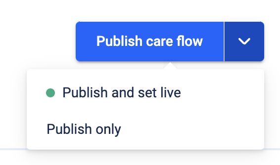

# Set Careflow as Live

[](https://github.com/super-linter/super-linter)

[](https://github.com/actions/typescript-action/actions/workflows/check-dist.yml)
[](https://github.com/actions/typescript-action/actions/workflows/codeql-analysis.yml)
[](./badges/coverage.svg)

## Usage

This GitHub action allows you to publish your care flow and allow the care flow
to run tests before publishing it live.



_Click publish only_. When you publish, your repository with the care flow code
can run a series of tests on push to main

```yaml
steps:
  - name: Checkout
    id: checkout
    uses: actions/checkout@v4

  # Your normal CI pipeline...
  - name: Test
    id: npm-test
    run: npm run test

  # Runs on successful tests ✅
  - name: Set published release as live
    id: set-live
    uses: awell-health/set-careflow-live@v1
    with:
      api-key: { { secrets.YOUR_API_KEY } }
      environment: production-us
```

## Issues

Please submit issues or comments here, or, if you have a slack channel with us,
feel free to get in touch!

## Contributing

Run `npm run all` to run the suite of tests, and make sure `npm run publish` is
run (part of `npm run all`) so the build is included in the release. The build
pipeline was provided by [GitHub](https://github.com/actions/typescript-action),
and the release script (to tag and push a new release) is also provided by
GitHub, in the `./scripts` directory.
